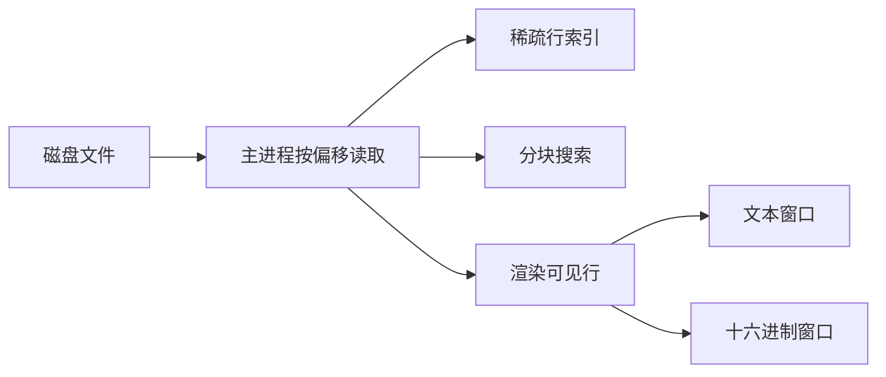

# EditLong

类似记事本的桌面编辑器：打开大文件时不整份装进内存，并提供十六进制浏览、搜索，以及截图、录屏和一组常用小工具。界面为中文，基于 Electron + Node.js。

## 能做什么

- **大文件浏览**：按偏移读取当前窗口，虚拟滚动；超过 16MB 只读，避免在文件中部插入导致整文件重写。
- **小文件编辑**：不超过 16MB 时按记事本方式编辑、保存、另存为。
- **文本 / 十六进制窗口**：文本带行号；二进制固定每行 16 字节（偏移、十六进制、ASCII）。
- **搜索**：普通文本或十六进制字节序列（如 `FF D8 FF`），按 4MB 分块扫描，不把整文件读进内存。
- **编码**：UTF-8、GBK、GB18030、Latin-1、UTF-16 LE；打开时识别 UTF-8 / UTF-16 BOM。
- **区域截图**：框选后钉在桌面最前，可画笔/文字标记、Ctrl+滚轮缩放，保存 PNG/JPG 或复制。
- **区域录屏**：框选区域输出 MP4（H.264）；可开关麦克风和电脑音频。
- **快捷工具箱**：时间戳互转、JSON 处理、图片批量转换、加解密。

## 设计要点

大文件不能整份读进内存，更不能放进普通 `textarea`。本编辑器把文件留在磁盘上，只按当前窗口读取一小段：



- **打开大文件**：主进程 `fs.open` + 按 `offset/length` 读字节，渲染进程只画屏幕上那几十行。
- **行号**：后台扫描换行，每 1024 行记一个偏移（稀疏索引），内存占用很小。
- **二进制窗口**：固定每行 16 字节，滚动即换窗口。
- **搜索**：4MB 分块扫描；支持普通文本和十六进制字节。
- **小文件编辑**：不超过 16MB 时进入记事本式编辑/保存；更大文件为只读浏览。

## 运行

需要 Node.js。首次 `npm install` 会拉取 Electron，以及录屏用的 `ffmpeg-static`（体积较大）。

```bash
npm install
npm start
```

开发启动同样是 `npm start`（`electron .`）。可选：`node scripts/smoke.js` 跑文件会话的打开、索引、文本/十六进制搜索与保存冒烟测试（不启动窗口）。

## 打包安装包

Windows x64 的 NSIS 安装程序（可改安装目录，会创建桌面和开始菜单快捷方式）：

```bash
npm install
npm run dist
```

产物在 `dist/EditLong-Setup-1.1.0-x64.exe`。录屏依赖 ffmpeg，安装包体积会比较大。仅解包目录、不生成安装程序时用 `npm run dist:dir`。`dist/` 和 `.exe` 已加入 `.gitignore`，不要提交到 GitHub（超过仓库文件大小限制）。

## 界面

菜单大致按记事本 / Notepad++ 习惯组织：**文件、编辑、搜索、编码、语言、设置、工具、窗口**。工具栏为图标按钮，对应新建/打开/保存、剪贴板、查找、文本与十六进制切换、工具箱、录屏、截图，以及编码下拉框。

| 菜单 | 内容 |
| --- | --- |
| 文件 | 新建、打开、最近文件、保存 / 另存为、关闭、退出 |
| 编辑 | 撤销重做、剪切复制粘贴删除、全选、大小写转换 |
| 搜索 | 查找、下一个 / 上一个、转到行号或 `0x` 偏移 |
| 编码 | 按所选编码重新解读当前文件 |
| 语言 | 状态栏语言标签（纯文本、C/C++、HTML、JS、JSON 等） |
| 设置 | 自动换行、窗口置顶、截图快捷键 |
| 工具 | 快捷工具箱、区域截图、区域录屏 |
| 窗口 | 文本 / 二进制视图 |

工具栏下方是文件标签栏：每个打开的文件占一个标签，未保存的会显示 `*`。点击切换，点 × 或中键关闭。打开对话框支持多选。关闭最后一个标签后回到欢迎页。

状态栏显示路径、行列、字节偏移、大小、语言和当前窗口类型。超过 16MB 打开后为只读浏览，文本窗口用虚拟列表而不是可编辑框。

## 快捷键

| 操作 | 快捷键 |
| --- | --- |
| 新建 | Ctrl+N |
| 打开 | Ctrl+O |
| 保存 / 另存为 | Ctrl+S / Ctrl+Shift+S |
| 关闭当前标签 | Ctrl+W |
| 切换标签 | Ctrl+Tab / Ctrl+Shift+Tab |
| 查找 | Ctrl+F |
| 查找下一个 / 上一个 | F3 / Shift+F3 |
| 转到行号或 `0x` 偏移 | Ctrl+G |
| 文本窗口 | Ctrl+1 |
| 二进制窗口 | Ctrl+2 |
| 区域截图 | Ctrl+Shift+A（可在「设置 → 截图快捷键」改） |
| 区域录屏 | Ctrl+Shift+R |
| 截图钉住窗口：缩放 | Ctrl+滚轮；点击百分比或 Ctrl+0 复位 |
| 截图钉住窗口：撤销标记 | Ctrl+Z |
| 截图 / 录屏设置：取消 | Esc |

## 截图

工具栏「区域截图」、菜单「工具 → 区域截图」，或默认 **Ctrl+Shift+A**。框选后出现置顶预览窗口：

- **移动**：拖窗口。
- **画笔 / 文字**：标记；可选颜色和线宽。
- **Ctrl+滚轮**：放大缩小（约 20%～800%）。
- **PNG / JPG / 复制**：保存或写入剪贴板。

快捷键写在用户数据目录的 `settings.json`（`snipShortcut`）。

## 录屏

工具栏录屏按钮、菜单「工具 → 区域录屏」，或 **Ctrl+Shift+R**。先弹出设置窗：

- **麦克风**：DirectShow 采集系统识别到的麦克风。
- **电脑音频**：优先「立体声混音」等环回设备；没有时会提示，并可尝试 WASAPI 环回。

开关会写入 `settings.json`（`recordMic`、`recordSysAudio`）。两个都关时只录画面。然后框选区域，用 ffmpeg `gdigrab` 抓屏、libx264 写成 MP4，停止后另存。

电脑声音录不到时，在 Windows「声音」设置里启用立体声混音，并允许应用使用麦克风后再试。录屏依赖 `ffmpeg-static` 自带的 ffmpeg。

## 快捷工具箱

工具栏箱子图标，或「工具」菜单。四个页签：

| 页签 | 功能 |
| --- | --- |
| 时间 | Unix 时间戳（秒 / 毫秒）与 `YYYY-MM-DD HH:mm:ss` 互转，可选时区 |
| JSON | 校验格式化、压缩、转义/去转义、Unicode 与中文互转 |
| 图片 | 多图拖入，转 JPEG/PNG/WebP，可压缩、改尺寸或按比例缩放后导出到目录 |
| 加解密 | AES-256-GCM、DES-ECB、MD5、Base64、SHA-1/256/512 |

加解密页是便民工具，**不要用来保护真正的机密**（尤其 DES / MD5）。AES 用口令经 PBKDF2 派生密钥；密文为 Base64。

## 技术栈与目录

- Electron 33，渲染进程隔离 + preload IPC。
- `iconv-lite` 做多编码解码。
- `ffmpeg-static` 做区域录屏。

```
src/main/          主进程：窗口、菜单、文件会话、工具箱、截图、录屏
src/renderer/      主界面、工具箱、截图钉住、录屏条
src/preload*.js    预加载桥
scripts/smoke.js   文件会话冒烟测试
```

超过 16MB 的文件只读；十六进制窗口始终按窗口读取，不会把整份二进制载入编辑器。
